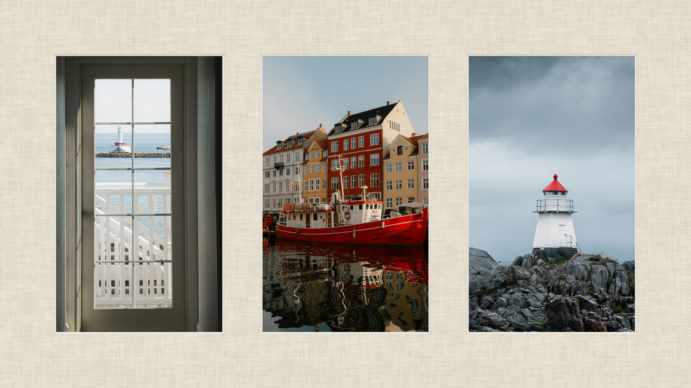
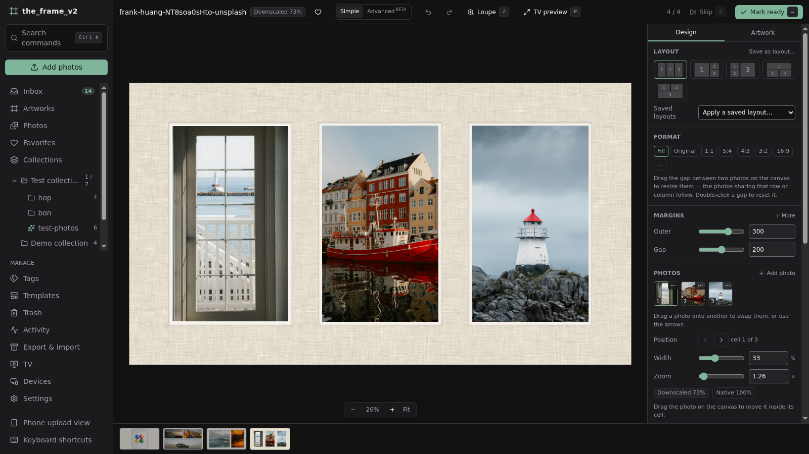
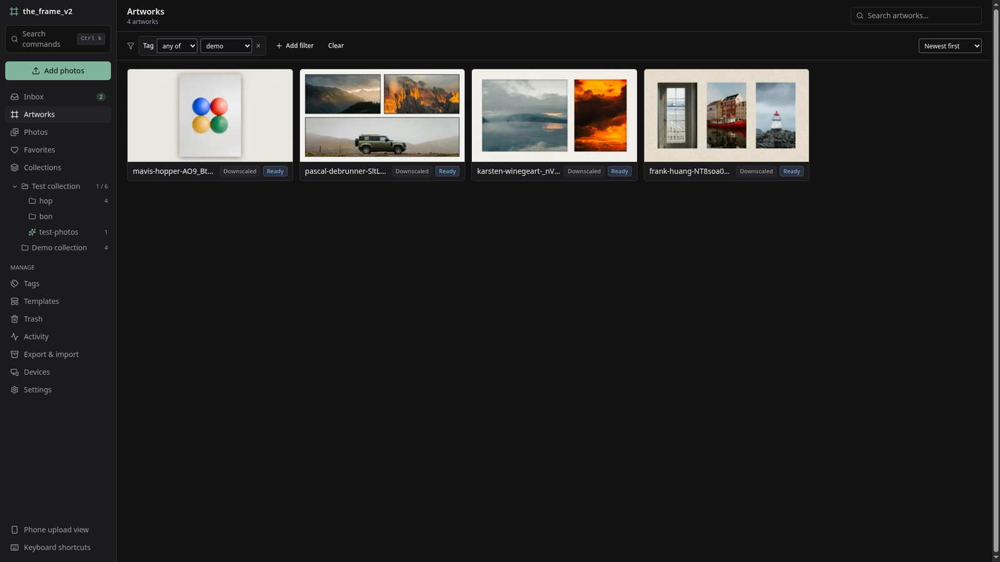
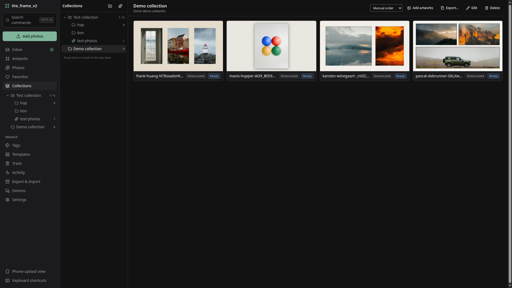
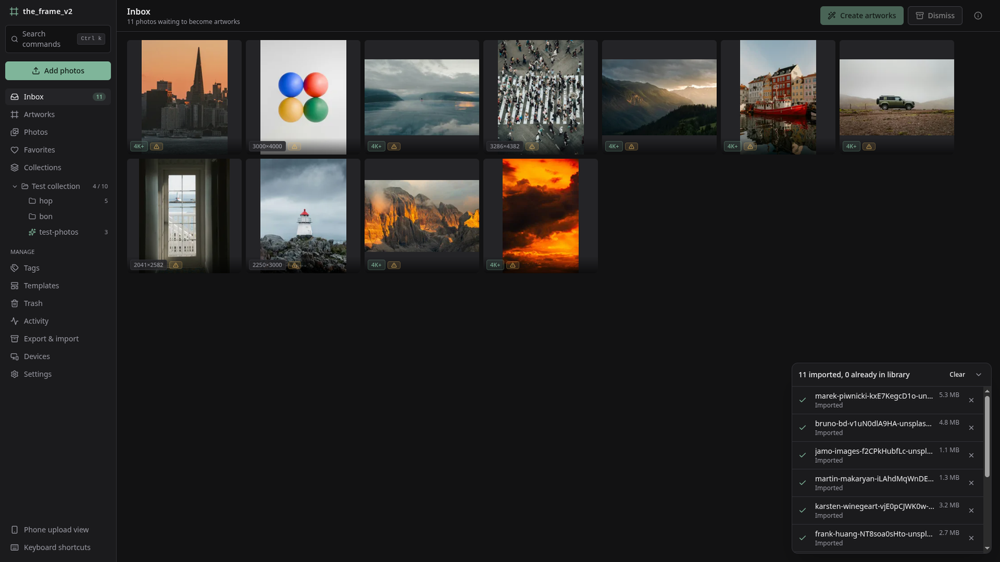

# the_frame_v2

Prepare and curate pictures for a 4K art-mode TV (Samsung The Frame): send originals from your
phone over Wi-Fi, frame them pixel-perfectly, group them in collections, export them as finished
3840×2160 images or send them straight to the TV.

Self-hosted, offline, one directory of files you own. *(Placeholder name; the rename is the last
open question — see [`docs/PLAN.md`](docs/PLAN.md) §16.)*

[](LICENSE)



<sup>What comes out: one 3840×2160 file. Demo photos from [Unsplash](https://unsplash.com) —
credits in [NOTICE.md](NOTICE.md).</sup>

## What it does

- **Phone uploads in full quality** over the LAN — resumable, deduplicated, no cloud. Pair a device
  by scanning a QR code, or send from [LocalSend](https://localsend.org) to keep GPS and filenames
  that Android's picker would otherwise strip.
- **A framing editor that keeps the geometry honest.** Pick an arrangement, then drag the outer
  margin, the gaps and the format: the layout re-solves so it stays even. A badge tells you at every
  moment whether a photo is **native**, **downscaled** or **upscaled**, and a per-photo lock stops
  the editor from ever stretching a picture behind your back.
- **A server-rendered loupe and TV preview**, so what you judge is the real output rather than the
  canvas's approximation.
- **Collections, smart collections, tags, favourites, search and a 30-day trash** where what was
  deleted together is restored together.
- **Export and import**: finished JPEGs/PNGs laid out by collection, or a `.tfarchive` backup that
  is a plain ZIP of JSON and your originals, with checksums. Importing shows a dry run first.
- **Show it on the TV**: find the Frame on your network, pair it once, and send a collection or a
  selection as an art-mode slideshow — or one artwork that stays on screen and leaves everything
  else on the TV untouched. Nothing the app did not send is ever deleted without your say-so
  ([`docs/tv-display.md`](docs/tv-display.md)).

## A look at it



**The editor.** Everything in the right-hand panel re-solves the layout as you drag it — the
arrangement, the outer margin, the gap, the format, the mat, the border. The selected photo is the
bright one; the badge under the zoom slider reads *Downscaled 70%*, and the button beside it snaps
that photo to *Native 100%*. The strip along the bottom is the review queue.

|  |  |
|---|---|
| [](docs/images/artworks.png) | [](docs/images/collections.png) |
| **The library.** Every artwork carries its worst quality tier, so a soft one cannot hide in the grid. | **Collections** nest and keep a manual order; a smart one stores a filter instead of a list. |



**The inbox.** New photos arrive with their pixel size and any quality warning, and the tray says
what happened to each file — including the ones the library already had.

## Status

**Phases 0–11 of [the plan](docs/PLAN.md) are implemented** — foundations, device pairing, uploads,
ingest, the artwork document and renderer, the editor, parametric compositions, templates,
organization, export/import, and the hardening pass. The name and a few §16 questions are the
remaining open items.

## Quick start

Requirements: Python 3.14 + [uv](https://docs.astral.sh/uv/), Node 22+ + pnpm.

```sh
make install
make serve          # builds the UI and serves everything on http://localhost:8765
```

On the computer running the server you are admin automatically. To add your phone: **Devices › Pair
a device**, then scan the QR code from the same Wi-Fi. From another computer, use the setup code
printed at startup (or `uv run the_frame_v2 setup-code`).

To keep it running across reboots:

```sh
uv run the_frame_v2 service install    # systemd user unit, or a launchd agent on macOS
```

### Docker

```sh
docker compose -f docker/compose.yaml up -d   # set THE_FRAME_V2_PUBLIC_URL first
```

LocalSend discovery needs host networking in Docker (see the comments in `docker/compose.yaml`).

**Full instructions, including what the quality tiers mean and how to get pictures out:
[docs/user-guide.md](docs/user-guide.md).**

## How it is built

Python 3.14 · FastAPI · pyvips (Lanczos3, sRGB) · SQLite. React + TypeScript (strict) · Vite ·
TanStack Query/Router · react-konva.

The geometry is a **pure, mirrored core**: the same rules exist in `backend/…/domain/` and
`frontend/src/editor/core/`, and shared JSON fixtures fail the build if the two ever disagree. That
is what lets the editor draw exactly what the server will render.

Originals are content-addressed and never modified. The cache is always safe to delete.

## Development

```sh
make dev     # API on :8765 with reload + Vite on :5173
make check   # ruff, ESLint, mypy strict, tsc, i18n keys, geometry conformance, pytest
```

Contributors: [CONTRIBUTING.md](CONTRIBUTING.md). Coding agents: start with
[AGENTS.md](AGENTS.md) — it is the maintained entry point.

## Licence and credits

MIT — see [LICENSE](LICENSE).

Place names © [GeoNames](https://www.geonames.org/) (CC BY 4.0). Bundled fonts are SIL Open Font
License 1.1; mat textures are CC0. Image processing by [libvips](https://www.libvips.org/). Full
attribution in [NOTICE.md](NOTICE.md).
